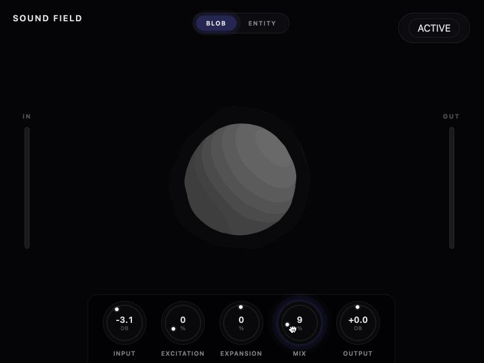

# Sound Field

Created by Michael Barzach

A creative audio visualizer plugin built with JUCE 8's WebView integration. The UI is a React + Three.js app running inside a native VST3/AU plugin.

The plugin has controls for stereo width and saturation, but the main focus here is the visualization: two reactive 3D modes that respond to the audio signal in real-time.

## Visualization Modes

### Dual Blob



Two layered blobs representing dry and wet signals. Vertices are displaced based on 10-band spectral analysis, and colors shift across a heatmap (grey to blue to green to yellow to red) based on energy levels. The inner blob shows the input signal, the outer shows the processed output. See `DualBlob.tsx` and `dualBlobShaders.ts`.

### Entity


A sphere with a solid core and transparent outer aura. The surface is deformed using 3D simplex noise, with displacement driven by spectral energy. The aura uses additive blending and responds to the mix parameter. Fresnel shading adds the rim glow effect. See `EntityBlob.tsx` and `entityShaders.ts`.

Both modes use `@react-three/fiber` and custom GLSL shaders.

## Why WebView?

JUCE 8's `WebBrowserComponent` lets you use the web stack for plugin UIs. This project uses React for components, Three.js for 3D rendering, Vite for hot reload during development, and TypeScript.

## Audio Processing

**Expansion** adjusts stereo width using M/S processing. The side signal gets scaled by the expansion amount.

**Excitation** adds saturation using an asymmetric waveshaper that generates even harmonics. See `PluginProcessor.cpp`.

## JUCE + React Integration

Parameters sync between C++ and React using JUCE's Web Relay system. Each parameter has a relay on the C++ side connected to the APVTS, and a hook on the React side that subscribes to changes.

For visualization data (RMS levels, spectral bands), the C++ side emits events on a timer which React picks up via `useJuceAudioAnalysis()` in `useJuceEvents.ts`.

Example of parameter binding on the React side:

```typescript
// useJuceEvents.ts
export function useJuceSlider(id: string, defaultValue: number) {
    const [value, setValue] = useState(defaultValue);

    useEffect(() => {
        const unsubscribe = window.__JUCE__.backend.addEventListener(id, (data) => {
            setValue(data.scaledValue);
        });
        return () => unsubscribe();
    }, [id]);

    const setValueFromUI = (newValue: number) => {
        window.__JUCE__.getSliderState(id)?.setScaledValue(newValue);
    };

    return [value, setValueFromUI];
}
```

## Project Structure

**C++ (Source/)**
- `PluginProcessor.cpp` - DSP, spectral analysis, parameter layout
- `PluginEditor.cpp` - WebView setup, data streaming to frontend

**React (WebUI/src/)**
- `App.tsx` - main component, canvas setup
- `components/DualBlob.tsx` - primary visualization
- `components/EntityBlob.tsx` - alternative visualization
- `components/ImmersiveControls.tsx` - knobs, meters
- `hooks/useJuceEvents.ts` - JUCE backend communication
- `shaders/dualBlobShaders.ts` - GLSL for dual blob
- `constants/entityShaders.ts` - GLSL for entity

## Building

**Requirements:** JUCE 8.0.3+, Xcode or Visual Studio, Node.js 18+

**Development (hot reload):**

1. Set `USE_DEV_SERVER = true` in `PluginEditor.h`
2. Run `cd WebUI && npm install && npm run dev`
3. Build the plugin and load it in your DAW

**Production:**

1. `cd WebUI && npm run build`
2. Set `USE_DEV_SERVER = false` in `PluginEditor.h`
3. Re-save the .jucer file in Projucer to regenerate BinaryData
4. Build the plugin

## License

MIT
